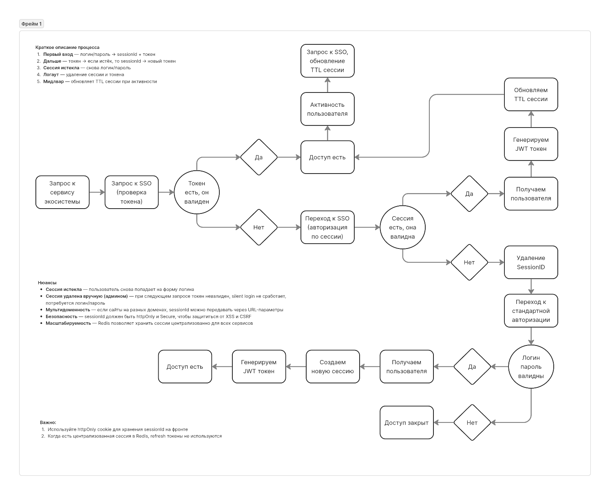

# SSO Сервис

<p align="center">
  <a href="http://nestjs.com/" target="blank"></a>
</p>

## Описание

SSO (Single Sign-On) - Микросервис для аутентификации и авторизации.

### Основные возможности

- ✅ Авторизация и аутентификация
- ✅ Пролонгация токена авторизации
- ✅ Возможность logout-а
- ✅ Настраиваемая защита от брутфорса
- ✅ Система блокировки токенов
- ✅ Настраиваемая ролевая система
- ✅ Рутовый пользователь
- ✅ Управление пользователями
- ✅ Система логирования
- ✅ Swagger документация
- ✅ Валидация токенов для сервисов экосистемы
- ✅ Мультисессионность (поддержка нескольких устройств)
- ✅ Авторизация через Telegram бота

### Схема работы SSO

<p align="center">
  
</p>

## Алгоритм SSO-авторизации

### 1. Попытка входа на сайт

- Проверяется наличие и валидность JWT-токена
- Если токен валиден — пользователь авторизован
- Если токен невалиден или отсутствует — переход к SSO

### 2. Проверка sessionId

- Если sessionId есть (например, в httpOnly cookie):
  - Запрос к SSO: `/auth/session/login` с sessionId
  - Если сессия валидна:
    - Получаем пользователя
    - Генерируем новый JWT-токен
    - Обновляем TTL сессии
    - Возвращаем токен фронту
  - Если сессия не найдена или истекла:
    - Удаляем sessionId
    - Переходим к классической авторизации
- Если sessionId нет — переход к классической авторизации

### 3. Классическая авторизация (логин/пароль)

- Пользователь вводит логин и пароль
- Запрос к SSO: `/auth/login`
- Если данные верны:
  - Получаем пользователя
  - Создаём новую сессию в Redis (sessionId)
  - Генерируем JWT-токен
  - Устанавливаем sessionId в httpOnly cookie
  - Возвращаем токен фронту
- Если данные неверны — 401 Unauthorized

### 3.1. Telegram авторизация

- Пользователь запрашивает ссылку для авторизации через Telegram
- Запрос к SSO: `/auth/tg/link`
- SSO генерирует уникальный ключ и возвращает ссылку на бота
- Пользователь переходит по ссылке и авторизуется в боте
- Бот отправляет запрос на SSO: `/auth/tg/confirm` с ключом и chatId
- Если пользователь с таким chatId существует:
  - Обновляем его telegramId
  - Возвращаем успешный ответ
- Если пользователя нет:
  - Создаём нового пользователя с указанным chatId
  - Возвращаем успешный ответ
- Фронтенд делает запрос на SSO: `/auth/tg/auth` с ключом
- Если ключ валиден:
  - Получаем пользователя
  - Создаём новую сессию в Redis
  - Генерируем JWT-токен
  - Возвращаем токен фронту
- Если ключ невалиден — 401 Unauthorized

### 4. Работа сессии и токена

- При каждом запросе к защищённому ресурсу:
  - Проверяется токен
  - Если токен валиден — доступ разрешён
  - Если токен истёк — инициируется silent login через sessionId
- Silent login:
  - Если токен истёк, но есть sessionId — запрос на `/auth/session/login` для получения нового токена

### 5. Пролонгация сессии

- При каждом действии пользователя (клик, AJAX-запрос и т.д.):
  - Фронт вызывает `/auth/session/refresh` с sessionId
  - SSO обновляет TTL сессии в Redis
  - Это предотвращает автоматический логаут при активной работе пользователя

### 6. Логаут

- Фронт вызывает один из эндпоинтов:
  - `/auth/logout` - удаление текущей сессии
  - `/auth/logout/all` - удаление всех сессий на всех устройствах
  - `/auth/session/delete` - удаление конкретной сессии
- SSO удаляет сессию(и) из Redis
- Очищается sessionId (cookie/localStorage)
- Токен становится невалидным

### 7. Валидация токена для сервисов экосистемы

- Сервисы экосистемы отправляют запрос на `/auth/validate`:
  - JWT токен в заголовке `Authorization: Bearer <token>`
  - Опционально: `sessionId` в теле запроса
- SSO проверяет:
  - Не заблокирован ли токен
  - Валиден ли токен
  - Если токен валиден - возвращает информацию о пользователе (ID, логин, имя, отдел, должность, email, телефон, telegramId, роли, флаг root, ID сессии)
  - Если токен невалиден и передан `sessionId` - пытается выполнить silent login
  - Если silent login успешен - возвращает информацию о пользователе
  - Если все проверки не прошли - возвращает ошибку

### 8. Мультисессионность

- Пользователь может иметь несколько активных сессий одновременно
- Каждая сессия привязана к конкретному устройству
- Максимальное количество сессий настраивается через `MAX_SESSIONS_PER_USER` (по умолчанию 5)
- При превышении лимита сессий:
  - Самая старая сессия автоматически удаляется
  - Создается новая сессия для текущего устройства
- Сессии хранятся в Redis с настраиваемым TTL (по умолчанию 24 часа)
- При валидации токена проверяется существование связанной сессии
- Пользователь может:
  - Удалить конкретную сессию через `/auth/session/delete`
  - Удалить все свои сессии через `/auth/logout/all`
  - Удалить текущую сессию через `/auth/logout`
  - Просмотреть список активных сессий

## Edge cases и нюансы

- **Сессия истекла** — пользователь снова попадает на форму логина
- **Сессия удалена вручную (админом)** — при следующем запросе токен невалиден, silent login не сработает, потребуется логин/пароль
- **Мультидоменность** — если сайты на разных доменах, sessionId можно передавать через URL-параметры или использовать OAuth2 flow
- **Безопасность** — sessionId должен быть httpOnly и Secure, чтобы защититься от XSS и CSRF
- **Масштабируемость** — Redis позволяет хранить сессии централизованно для всех сервисов
- **Валидация токена** — сервисы экосистемы должны проверять токен через SSO, а не самостоятельно
- **Мультисессионность** — при удалении сессии все связанные с ней токены становятся невалидными

## Краткое описание процесса

1. **Первый вход** — логин/пароль → sessionId + токен
2. **Дальше** — токен → если истёк, то sessionId → новый токен
3. **Сессия истекла** — снова логин/пароль
4. **Логаут** — удаление сессии и токена
5. **Мидлвар** — обновляет TTL сессии при активности
6. **Валидация** — сервисы проверяют токен через SSO
7. **Мультисессионность** — управление несколькими сессиями с разных устройств

## Рекомендации

> **Важно:**  
> - Используйте httpOnly cookie для хранения sessionId на фронте
> - Когда есть централизованная сессия в Redis, refresh токены не используются
> - Все сервисы экосистемы должны проверять токены через SSO, а не самостоятельно
> - При получении ошибки валидации токена, сервисы должны перенаправлять на SSO для повторной авторизации
> - Настройте оптимальное количество максимальных сессий на пользователя
> - Регулярно очищайте неактуальные сессии из Redis

## Авторы

- Author - [ASt](https://github.com/ast39)
- Telegram - [@ASt39](https://t.me/ASt39)

## Лицензия

ASt

## Установка и запуск

### Предварительные требования

- Node.js
- PostgreSQL
- Redis
- Yarn

### Установка

```bash
# Установка пакетов
yarn install

# Выполнение миграций
yarn prisma migrate deploy

# Выполнение сидеров
yarn prisma db seed

# Копирование шаблона для env настроек проекта 
cp .env.example .env
```

### Управление Prisma ORM

```bash
# Создание миграции
yarn prisma migrate dev --name init

# Обновление Prisma Client по схеме  
yarn prisma generate

# Обновление базы данных по файлам миграции в режиме разработки
yarn prisma migrate dev

# Устранение проблем с миграциями базы данных
yarn prisma migrate resolve

# Обновление базы данных по неисполненным миграциям в прод. режиме
yarn prisma migrate deploy

# Запуск сидов, заполняющих таблицы тестовыми данными
yarn prisma db seed
```

### Запуск приложения

```bash
# В режиме разработки
yarn start:dev

# В продакшн режиме
yarn start:prod
```

## Ролевая система

```typescript
// Доступ только по JWT токену 
// Вешается как на метод, так и на весь контроллер
@UseGuards(JwtAuthGuard)

// Доступ только рутовой учетке
// Вешается как на метод, так и на весь контроллер
@UseGuards(IsRootGuard)

// Доступ только учетке с указанными правами (одними из указанных)
// Вешается как на метод, так и на весь контроллер
@Roles('finance,hr')
```

## API Endpoints

### Авторизация

```typescript
// Логин
POST /auth/login
Body: { login: string, password: string }
Response: { accessToken: string, roles: string[], isRoot: boolean, sessionId: string }

// Telegram авторизация
// 1. Получение ссылки для авторизации
POST /auth/tg/link
Response: { link: string }

// 2. Подтверждение авторизации в боте
POST /auth/tg/confirm
Body: { authKey: string, chatId: string }
Response: { success: boolean }

// 3. Авторизация по ключу
POST /auth/tg/auth
Body: { authKey: string }
Response: { accessToken: string }

// Получение информации о текущем пользователе
GET /auth/me
Headers: Authorization: Bearer <token>
Response: { id: number, login: string, name: string, department: string, position: string, email: string, phone: string, telegramId: string, roles: string[], isRoot: boolean }

// Логаут текущей сессии
POST /auth/logout
Headers: Authorization: Bearer <token>
Response: { success: boolean }

// Глобальный логаут (все сессии)
POST /auth/logout/all
Headers: Authorization: Bearer <token>
Response: { success: boolean }

// Удаление конкретной сессии
POST /auth/session/delete
Body: { sessionId: string }
Response: { success: boolean }

// Silent login по сессии
POST /auth/session/login
Body: { sessionId: string }
Response: { accessToken: string, roles: string[], isRoot: boolean, sessionId: string }

// Обновление сессии
POST /auth/session/refresh
Body: { sessionId: string }
Response: { success: boolean }

// Валидация токена
POST /auth/validate
Headers: Authorization: Bearer <token>
Response: { id: number, login: string, name: string, ... }
```